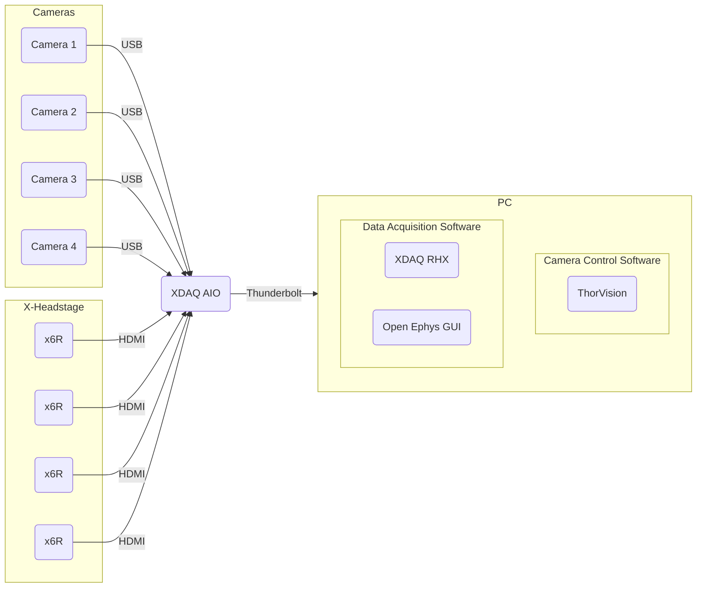
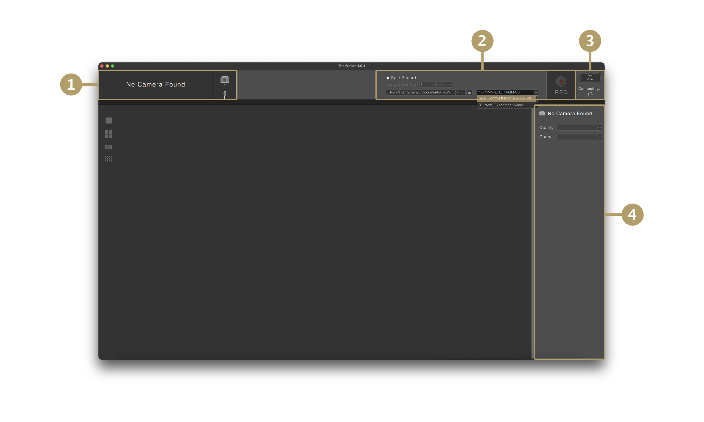
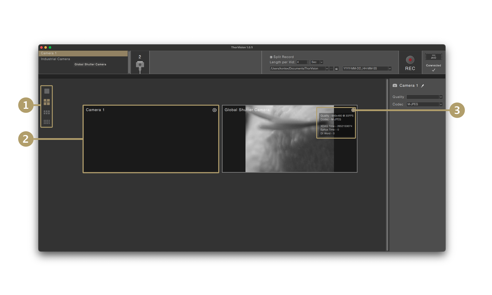
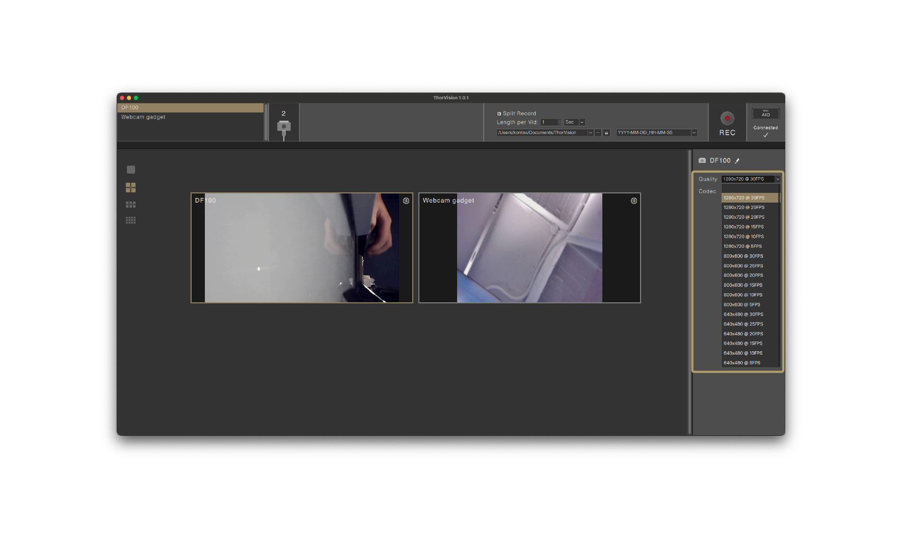
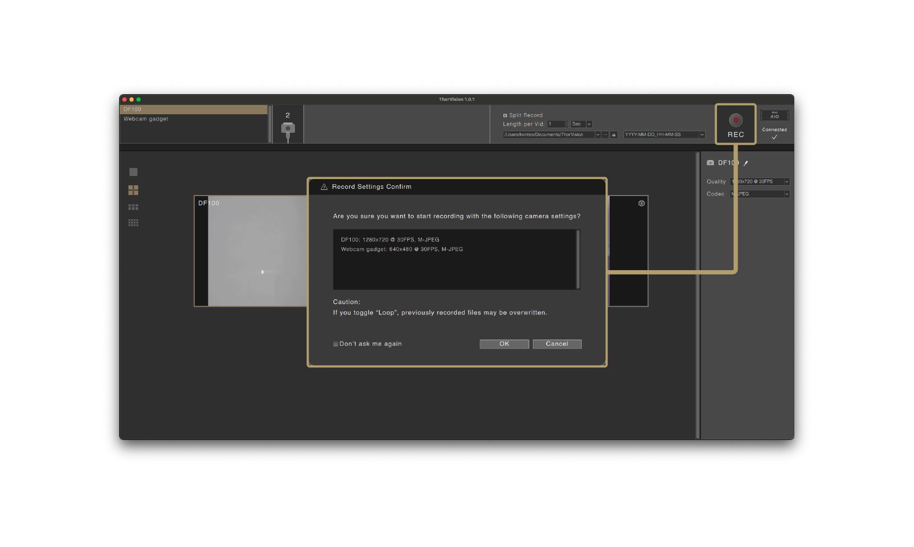
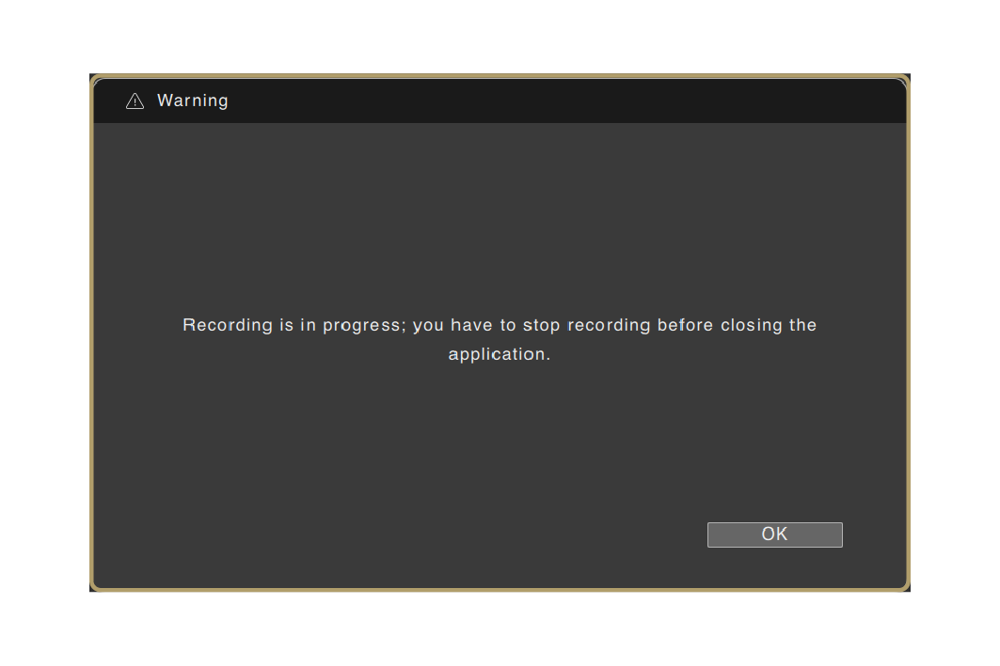

## Overview

ThorVision is a GUI app designed for seamless control and video capture from USB cameras on the [XDAQ AIO](https://www.kontex.io/xdaq). This user manual provides instructions on how to use the features of the application effectively.

---

## Hardware Requirements

- **PC**: Mac (Apple silicon only) and Windows with a Thunderbolt 3.0 port (or higher).
- [**XDAQ AIO**](https://www.kontex.io/xdaq).
- **Thunderbolt 3.0 Cable** (or higher).
- [**UVC (USB Video Class) Cameras**](usb-cameras.md).

---

## Installation

[:fontawesome-brands-windows:](https://github.com/kontex-neuro/ThorVision/releases/download/v1.0.1/ThorVision-1.0.1-win64.exe){ .icon-large }
[:fontawesome-brands-apple:](https://github.com/kontex-neuro/ThorVision/releases/download/v1.0.1/ThorVision-1.0.1-mac-arm64.dmg){ .icon-large }
<!-- [:fontawesome-brands-ubuntu:](){ .icon-large } (coming soon) -->

---

## Panels

### **1. Camera Status**

Display the list and number of currently connected cameras. Select a camera from the list to access its settings in the [Camera Specification Panel](#4-camera-specification-panel). 

### **2. Overall Recording Settings & Control**

Saving Options: Choose between:

- **Continuous:** Record a single, uninterrupted video file for the entire recording session.
- **Split Record:** Record multiple video files, each divided into predefined segments (e.g., 5 seconds, 10 seconds).

Record Path: Click `...` button to select the folder for saving recordings.

Folder Name: Choose between:

- **Automatically generated:** folder name in `YYYY-MM-DD_HH-MM-SS` format.
- **Custom:** Specify a custom folder name.

/// note | Note
The default record path:

Windows: `C:/Users/<user_name>/Documents/ThorVision/`

macOS: `/Users/<user_name>/Documents/ThorVision/`
///

### **3. XDAQ Status**

- **Connecting...:** is displayed when [XDAQ AIO](https://www.kontex.io/xdaq) is not yet connected or currently connecting.
- **Connected:** is displayed when [XDAQ AIO](https://www.kontex.io/xdaq) is connected.

The status transition may take some time, please be patient.

### **4. Camera Specification Panel**

Edit camera names, configure the `Quality`, and `Codec` in this area.

---

## Camera Feed

### **1. Camera Views**

View stream windows under different scales.

### **2. Live Preview Window**

View live streams from cameras on the [XDAQ AIO](https://www.kontex.io/xdaq).

### **3. Information Icon**

Click to display live metadata and configured recording settings from cameras on the [XDAQ AIO](https://www.kontex.io/xdaq).

---

## Setup Guide

### **Pre-Launch Checklist**

1. Ensure a Thunderbolt 3.0 (or higher) cable connects the [XDAQ AIO](https://www.kontex.io/xdaq) and the computer. 
2. Verify that the connectors are firmly seated.
3. Confirm all cameras are firmly connected to the [XDAQ AIO](https://www.kontex.io/xdaq).
4. Connect a [Brainwave simulator](https://www.kontex.io/product/Brainwave-Simulator) to the [XDAQ AIO](https://www.kontex.io/xdaq) using a 3.5mm jack to BNC wire.
5. Connect the 3.5mm Jack to the "Pulse" port on the [Brainwave simulator](https://www.kontex.io/product/Brainwave-Simulator).
6. Connect the BNC to the Digital In port on the front panel of the [XDAQ AIO](https://www.kontex.io/xdaq).

### **Launch Sequence**

Follow this exact order:

1. Power on [XDAQ AIO](https://www.kontex.io/xdaq).
2. Launch [Open Ephys GUI](https://open-ephys.org/gui) or [XDAQ-RHX](https://github.com/kontex-neuro/Intan-RHX) first.
3. Wait until the chosen application finishes its initialization.
4. Launch ThorVision.
5. Allow 1–2 minutes for ThorVision to connect.
6. If the connection fails, retry the entire [launch sequence](#launch-sequence) from the start.

### **Camera Setup**

1. Once ThorVision connects to the [XDAQ AIO](https://www.kontex.io/xdaq), check the [camera status panel](#1-camera-status) to confirm all connected cameras are listed. If not, check the cable connections.

    - **INFO:** Before assigning `Quality` and `Codec`, you can still hot-plug cameras to the [XDAQ AIO](https://www.kontex.io/xdaq). It may take a few seconds for the [XDAQ AIO](https://www.kontex.io/xdaq) to recognize a newly connected camera.

    

2. On the right panel in ThorVision, assign a unique name, `Quality` and `Codec` to the selected camera. **Before recording, make sure every camera on the list has both a `Quality` and a `Codec` assigned.**

/// tip | Tip
* If the preview stream doesn't appear within 10 seconds, re-select the same `Quality` / `Codec` settings to refresh the view.

* If the camera-naming function behaves abnormally, restart the ThorVision interface and try again.
///

/// warning | IMPORTANT
- Do **NOT** assign the same name to different cameras. This can cause file overwrites during recording sessions.

- Do **NOT** change `Quality` / `Codec` once the preview has started. This can cause the camera to freeze.
///

  
  <ol>
    <li>Select a camera you want to edit.</li>
    <li>Assign a unique name.</li>
    <li>Configure <code>Quality</code> &amp; <code>Codec</code>.</li>
  </ol>

<ol start="3">
  <li>
    To view camera activities (e.g., DI triggers), press the <a href="#3-information-icon">Information Icon</a> in each preview window. 
    The <code>DI word</code> will show the channel number when the voltage in a certain Digital In BNC port is pulled to high.
    <ul>
      <li><strong>INFO:</strong> If the timestamp stops renewing or stays at zero during preview or recording, the camera is offline. Repeat the <a href="#launch-sequence">Launch Sequence</a>.</li>
    </ul>
    
  </li>
  <li>
    Check the recording settings (e.g., file interval, saving location, file name), and then press <code>REC</code>.
  </li>
</ol>

/// warning | IMPORTANT
When restarting a recording session, **WAIT 5 SECONDS** after stopping before pressing the record button again. Do not consecutively press the button more than one time!
///

---

## Recording Tips

Configure the camera’s recording settings to view the real time camera feed. The same settings will also be applied to video recording.

Press the **`REC`** button to start recording on all connected cameras simultaneously. The Stop Recording button works the same way. In the pop-up window, you can review the recording specifications. Use unique camera names only.

If XDAQ is disconnected, ThorVision will automatically stop recording.

You must stop recording before closing the ThorVision app.

---

## **Golden Rules (TL; DR)**

- Launch Order is Critical: [XDAQ AIO](https://www.kontex.io/xdaq) >>> [OE GUI](https://open-ephys.org/gui) / [RHX](https://github.com/kontex-neuro/Intan-RHX) >>> ThorVision.
- Set the `Quality` / `Codec` once and never change it during the session.
- Use unique camera names only.
- Do not hot-plug cameras while recording.
- Wait at least 5 seconds after stopping a recording before starting a new one.