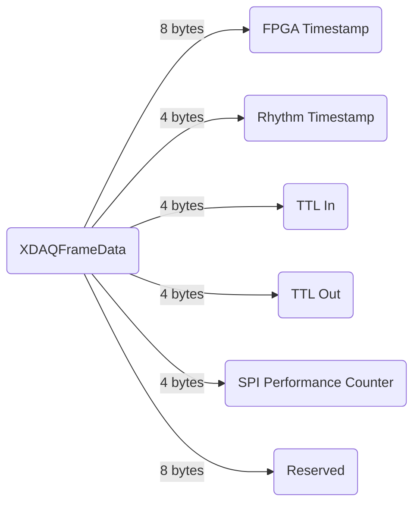
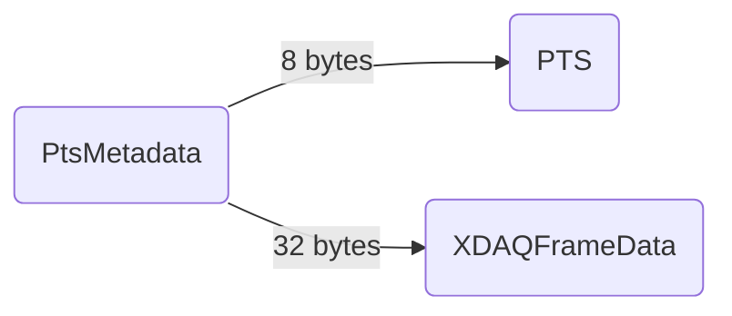

# XDAQ Metadata

## Data Structure

`XDAQFrameData` is embedded into camera frames captured by [XDAQ AIO](https://www.kontex.io/xdaq) and streamed live to a PC via Thunderbolt. Each recorded frame contains both the JPEG encoded image data and its associated XDAQ metadata.

/// note | Note
Record H.265 encoded videos (coming soon)
///

## File Extension

`PtsMetadata` is saved as a flat binary file, containing continuous metadata associated with video frames for further [metadata processing](metadata-processing.md).
